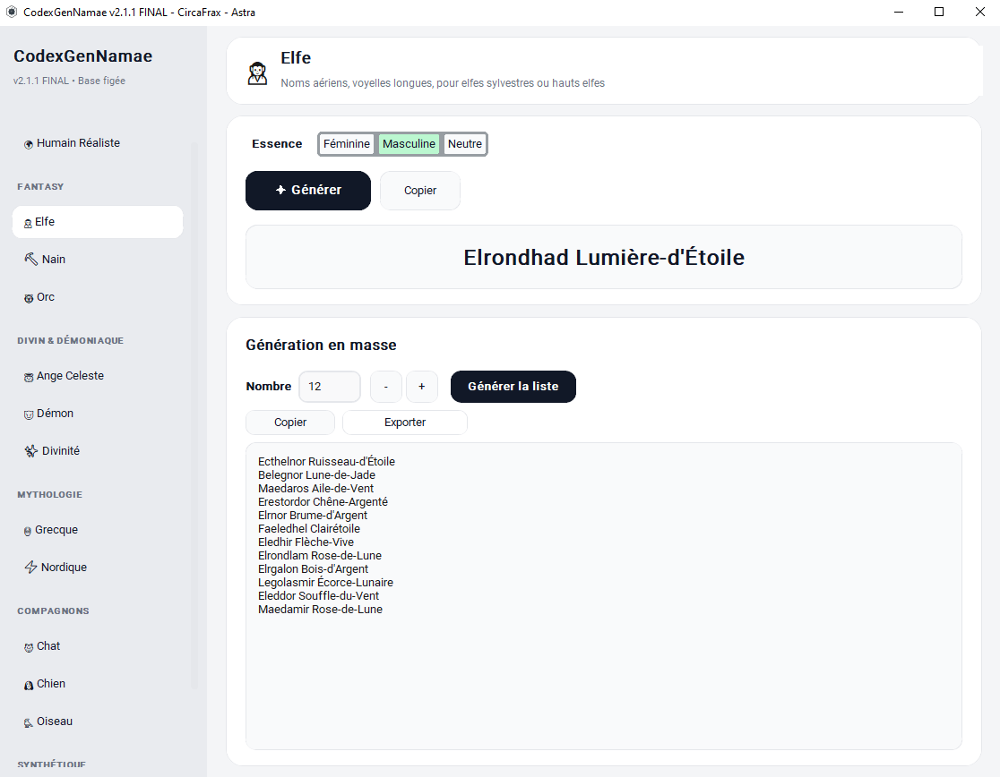

<p align="center">
  
</p>

# CodexGenNamae v2.2.2

<p align="center">
  
</p>

<p align="center">

### ⬇️ [Télécharger CodexGenNamae v2.2.2 (Windows)](https://github.com/CircaFrax/CodexGenNamae/releases/download/v2.2.2/CodexGenNamae_v2.2.2.zip)
`SHA256: e00053d9b0b7407f0c594797cd03e2f7be7520f22ffa80d3ee1f98dfa99e9471`

</p>


CodexGenNamae
Générateur d'identités françaises, fantasy et compagnons — pour MJ, refuges, écrivains et devs. Offline, gratuit, sans pub.

CodexGenNamae est un utilitaire léger, pensé pour donner un nom cohérent en un clic. Pas d'API, pas de cloud. Il tourne sur un vieux PC sous Windows 10, même sans internet. Un clic, une identité. Ou 1000.

## Aperçu

*Menu à gauche, prévisualisation à droite – 100% offline*

Fonctionnalités v2.2.2
Identité unique : prénom + nom / lignée / clan cohérent
Génération en masse : 12, 100, 1000 noms d'un coup (TXT / MD / CSV)
Genres : Féminine / Masculine / Neutre → vert clair #BBF7D0
14 Univers (sans doublons) :
<pEssentiels :
-🧑 Humain Réaliste
</p>
Fantasy :
-🧝 Elfe (Aube-de-Givre...), ⛏️ Nain (Barbe-d'Acier...), 👹 Orc (Arrache-Tripes...)
-Divin & Démoniaque :
-👼 Ange Céleste, 😈 Démon, ✨ Divinité
Mythologie : 🏺 Grecque, ⚡ Nordique
Cyber & Synth : 🌃 Netrunner, 🤖 Synthétique
Compagnons : 🐱 Chat (29F/29H/27N), 🐶 Chien, 🐦 Oiseau — F/H/Neutre (Chaussette, Biscuit...)

Utilisation
Lancer CodexGenNamae.exe
Choisir un univers à gauche (Essentiels, Fantasy, Divin & Démoniaque...)
Choisir Féminine / Masculine / Neutre
Générer → Copier
Génération en masse → Copier / Exporter en TXT, MD, CSV

### 📁 Structure

```
CodexGenNamae/
├───CodexGenNamae.exe
├───LICENCE.md
├───LICENSE.md
└───THIRD_PARTY_LICENSES.md
```

### 🔒 Confidentialité
- **Zéro réseau** : tout se passe sur votre PC


### 📄 Licence
CircaFrax Proprietary Freeware

---
**Fait partie de la suite Codex** — des logiciels qui s'utilisent sans installation, comme en 1998, mais en mieux.

